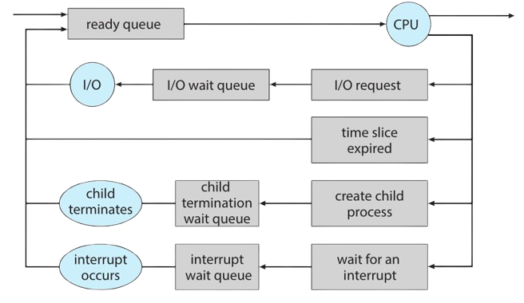

A progarm is an passive entity such as a file containing a list of instructions stored on disk (often called an executable fil ). In contrast, a process is an active entity, with a program counter specifying the next instruction to execute and a set of associated resources.

A process may be in one of the following states:
    
    1.New. The process is being created.
    2.Running. Instructions are being executed.
    3.Waiting. The process is waiting for some event to occur (such as an I/Ocompletion or reception of a signal).
    4.Ready. The process is waiting to be assigned to a processor.
    5.Terminated. The process has finished execution.

An `I/O-bound` process is one that spends more of its time doing I/O than it spends doing computations.
 A `CPU-bound process`, in contrast, generates I/O requests infrequently, using more of its time doing computations.

