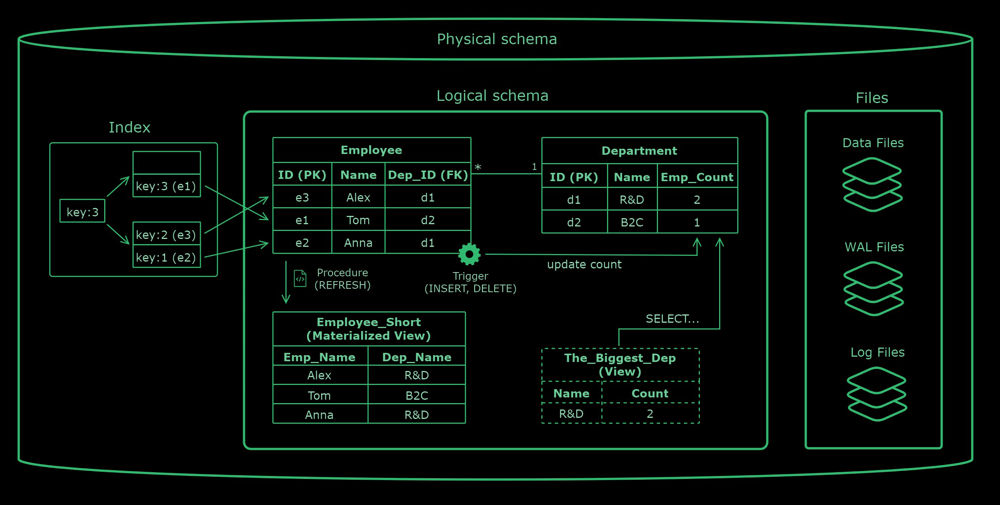
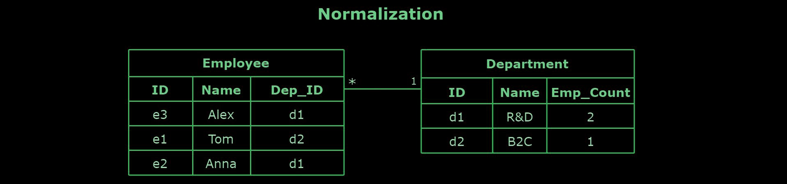
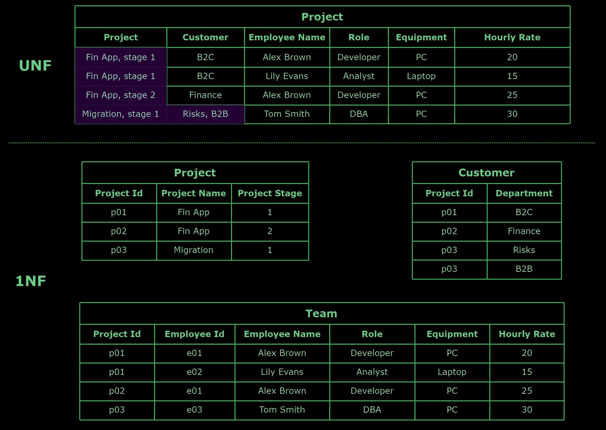
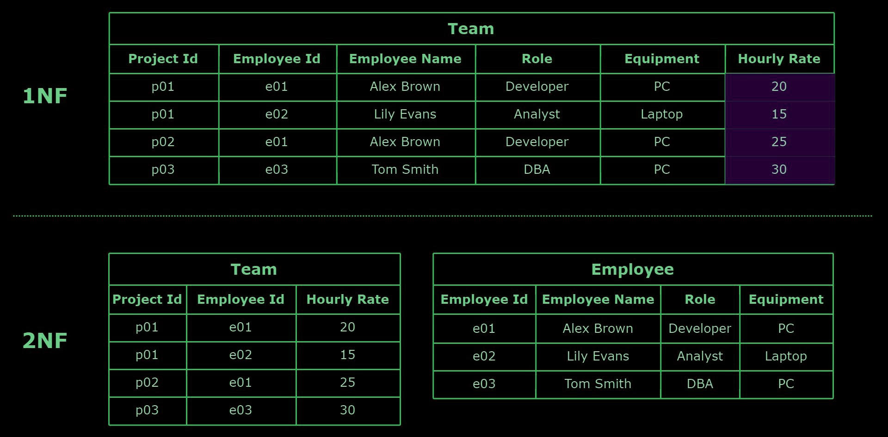
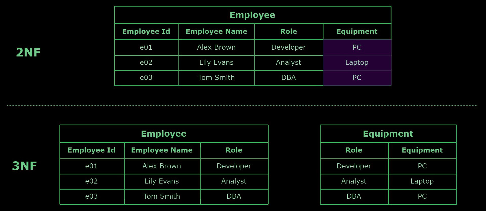
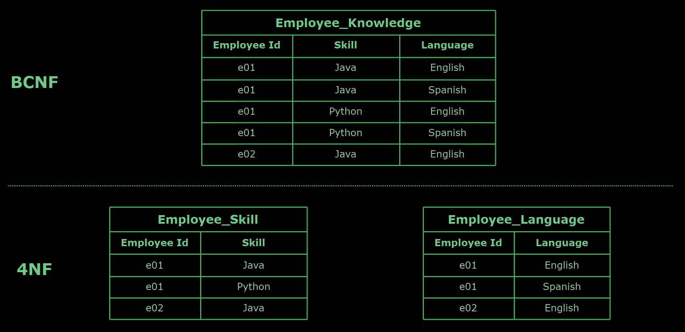
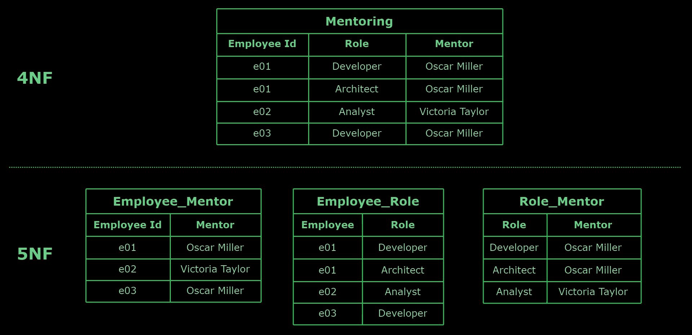

# DataBase Design

## Table of Contents

<ul>
  <li>
    <a href="#rdbms">RDBMS</a>
  </li>
  <ul>
      <li>
        <a href="#popular-rdbms">Popular RDBMS</a>
      </li>
  </ul>
  <li>
    <a href="#terminology">Terminology</a>
  </li>
  <li>
    <a href="#erd-entity-relationship-diagram">ERD (Entity Relationship Diagram)</a>
  </li>
  <ul>
      <li>
        <a href="#components">Components</a>
      </li>
      <li>
        <a href="#types">Types</a>
      </li>
      <li>
        <a href="#crows-foot-notation">Crow's Foot Notation</a>
      </li>
      <li>
        <a href="#relationships">Relationships</a>
      </li>
  </ul>
</ul>

<ul>
  <li>
    <a href="#normalization">Normalization</a>
  </li>
  <ul>
      <li>
        <a href="#normal-forms">Normal Forms</a>
      </li>
      <li>
        <a href="#first-normal-form-1nf">First Normal Form (1NF)</a>
      </li>
      <li>
        <a href="#second-normal-form-2nf">Second Normal Form (2NF)</a>
      </li>
      <li>
        <a href="#third-normal-form-3nf">Third Normal Form (3NF)</a>
      </li>
      <li>
        <a href="#fourth-normal-form-4nf">Fourth Normal Form (4NF)</a>
      </li>
      <li>
        <a href="#fifth-normal-form-5nf">Fifth Normal Form (5NF)</a>
      </li>
      <li>
        <a href="#denormalization">Denormalization</a>
      </li>
  </ul>
</ul>

## RDBMS

A `relational database` is a type of database that stores and organizes data in tables with rows and columns. It is based on the relational model, which uses a structure that permits the identification and access of data with another piece of data in the database.
 

An `RDBMS`, or `Relational Database Management System`, is a software system that manages relational databases and facilitates the creation, updating, and administration of a relational database using SQL. It supports data integrity, transaction processing, and concurrent access to ensure efficient and secure data management stored in relational database structures.
 

### **Popular RDBMS**

- `Oracle Database` - A comprehensive RDBMS solution for enterprise-level data management, known for its robust feature set, scalability, and security.
- `MySQL` - An open-source RDBMS widely used for web applications and as a component of the LAMP stack (Linux, Apache, MySQL, PHP/Python/Perl).
- `Microsoft SQL Server`: Microsoft developed a relational database management system to support various data types and applications, from small websites to large enterprise applications.
- `PostgreSQL`: An open-source, object-relational database system known for its standards compliance, extensibility, and support for advanced data types.
- `SQLite`: A C-library that implements a small, fast, self-contained, high-reliability, full-featured SQL database engine.

## Terminology

- `Physical Schema`: Describes how data is stored in the database, including files, indexes, and storage mechanisms. It deals with the optimization of storage resources and data access methods.
- `Logical Schema`: Represents the abstract design of the data structure, including the tables and relationships, without detailing how data is stored physically. It focuses on defining entities, relationships, and constraints.
- `Table`: A collection of related data entries organized in rows and columns, representing a specific entity such as customers or orders.
- `Row`: A single, horizontal dataset in a table representing a specific entity instance, each row containing unique data for the defined columns.
- `Column`: A vertical dataset in a table representing an entity's attribute, where each column holds data of a particular type.
- `Constraints`: Rules enforced on database tables and columns to ensure data integrity and accuracy and enforce business logic, preventing invalid data entry and maintaining consistency across the database.
  - `Primary key`: Ensures each row in a table has a unique identifier, disallowing NULL values.
  - `Foreign key`: Establishes a relationship between tables, ensuring that one table's value matches another table's primary key.
  - `Unique`: Guarantees that all values in a column or a set of columns are distinct, allowing for one NULL value if not part of a PRIMARY KEY.
  - `Check`: Specifies a condition that each value in a column must meet, ensuring data adheres to specific rules.
  - `Not NULL`: Ensures that a column cannot hold NULL values, guaranteeing that data is always entered for specific columns.
  - `Default`: Assigns a default value to a column when no other value is specified during data insertion.
- `Index`: A data structure that improves the speed of data retrieval operations on a table, making finding rows based on the column values faster.
- `Stored Procedures`: Predefined SQL commands stored in the database that can be executed to perform various operations, including data manipulation and transaction management.
- `Triggers`: Procedures automatically executed in response to specific events on a particular table or view, such as insertions, updates, or deletions.
- `Views`: Virtual tables created based on the result set of an SQL statement, which can simplify complex queries, aggregate data, or restrict access to specific data within the database.
- `Materialized View`: A physical copy of the result set of a specific SQL query stored in the database. Unlike virtual views, which query the underlying tables every time they are accessed, materialized views are updated periodically.

## ERD (Entity Relationship Diagram)

An Entity-Relationship Diagram `(ERD)` is a graphical representation of entities and their relationships to each other. An ER diagram helps structure and organize data requirements before developing a database.

### **Components**

- `Entities`: Represent real-world objects or concepts in the database.
  - `Strong Entity:` A type of entity that has a key Attribute
  - `Weak Entity`: An entity that does not have a primary key attribute.
- `Attributes`: Characteristics or properties of entities.
  - `Key Attribute`: Used to represent the main characteristics of an entity. It represents a primary key.
  - `Composite Attribute`: An attribute that is composed of many other attributes
  - `Multivalued Attribute`: An attribute that can have multiple values.
  - `Derived Attribute`: An attribute that can be derived from another attribute
- `Relationships`: Depict how entities are related to each other.
  - `One-to-One`
  - `One-to-Many`
  - `Many-to-One`
  - `Many-to-Many`

### **Types**

- `Conceptual`: High-level, abstract design without specific details about technologies or data types.
- `Logical`: More detailed, including specific entities, relationships, and attributes but not entirely tied to a particular database management system (DBMS).
- `Physical`: Includes all constraints, indexes, and specific technologies that will be implemented in the database.

### **Relationships**

#### **Crow's Foot Notation:**

Relationships are essential to describe how data in one table corresponds to data in another table:

- `One-to-One:` Each record in Table A is related to exactly one record in Table B, and vice versa.
  - Use this relationship when data can logically belong to a single entity but is stored separately for organizational or security purposes.
- `Many-to-One:` Many records in Table A can be related to one record in Table B.

  - In this case, the foreign key is stored in the "many" table (Table A), referencing the primary key of the "one" table (Table B).

- `Many-to-Many:` Many records in Table A can relate to many records in Table B.
  - This requires an `associative table` (or junction table) that contains foreign keys referencing both Table A and Table B. The primary key of the associative table is typically a composite key composed of these foreign keys.

## Normalization

Normalization involves applying a set of rules or _"normal forms"_ to ensure the database structure is clear, efficient, and able to handle updates and queries reliably. It aims to reduce redundancy and improve data integrity by ensuring that each piece of data is stored only once.

### **Normal Forms**

Normal forms are a series of guidelines or rules used in normalization. There are several normal forms, each building upon the principles of the previous one. While achieving high levels of normalization offers significant benefits, it comes with tradeoffs regarding performance and ease of use. Balancing these factors requires careful consideration based on the specific demands of the application.

### **First Normal Form (1NF)**

Each column in a table must contain a single value, have a unique name, and the order of data storage should not affect the table's integrity.

 

### **Second Normal Form (2NF)**

All non-key attributes must be _fully functionally dependent_ on the primary key, and if the primary key is composite, each non-key attribute must depend on the entire key, not just a subset.

 

### **Third Normal Form (3NF)**

No _transitive dependency_ exists, ensuring that non-key attributes are _not_ dependent on other non-key attributes.

 

### **Fourth Normal Form (4NF)**

The table should not have two or more independent and multivalued data describing the relevant entity.

 

### **Fifth Normal Form (5NF)**

The table can be decomposed into any number of smaller tables without loss of data.

 

### **Denormalization**

Denormalization improves query performance and simplifies schema design for read-heavy operations but increases data redundancy, maintenance complexity, and the risk of data anomalies.

 

