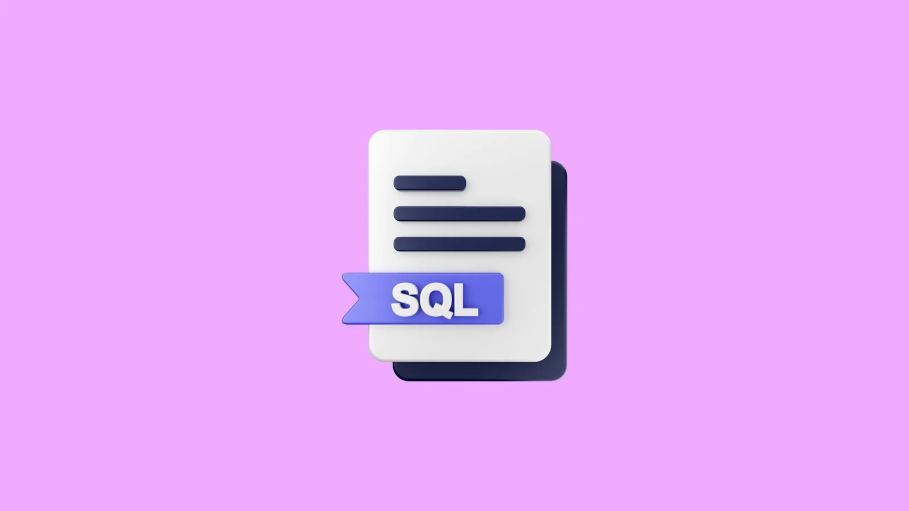
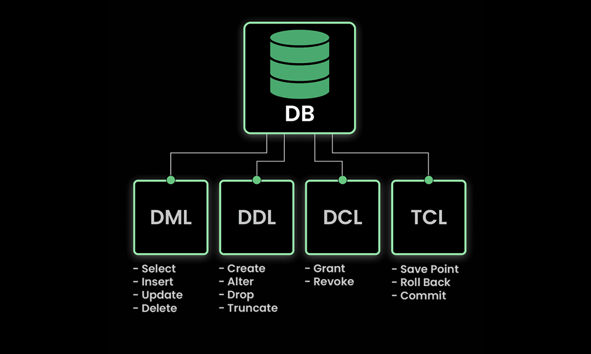
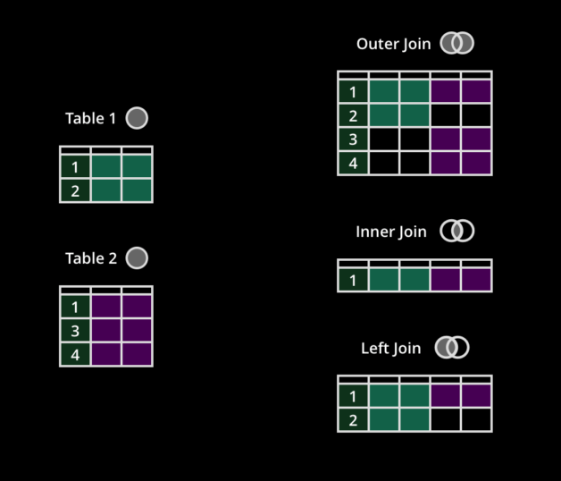
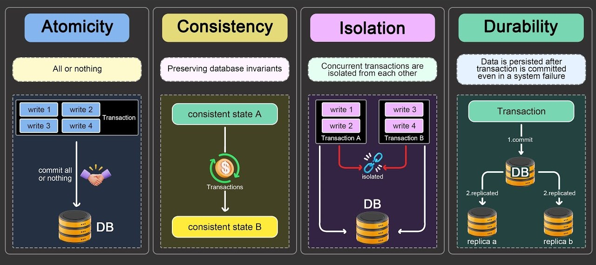

# SQL



## Table of Contents

- [Introduction](#introduction)

- [Command Types](#command-types)

  - [Data Definition Language (DDL)](#data-definition-language-ddl)
  - [Data Manipulation Language (DML)](#data-manipulation-language-dml)
  - [Transaction Control Language (TCL)](#transaction-control-language-tcl)
  - [Data Control Language (DCL)](#data-control-language-dcl)

- [Data Types](#data-types)

  - [Numeric Data Types](#1-numeric-data-types)
  - [Character Data Types](#2-character-data-types)
  - [Date and Time Data Types](#3-date-and-time-data-types)
  - [Logical Value Data Types](#5-logical-value-data-types)
  - [Binary Data Types](#5-binary-data-types)

- [Operators](#operators)

  - [Arithmetic Operators](#arithmetic-operators)
  - [Comparison Operators](#comparison-operators)
  - [Logical Operators](#logical-operators)
  - [Set Operators](#set-operators)
  - [String Operators](#string-operators)
  - [Wildcards](#wildcards)

- [Data Definition](#data-definition)

  - [Create Table](#create-table)
  - [Alter Table](alter-table)
  - [Rename Table](#rename-table)
  - [Copy Table](#copy-table)
  - [Drop Table](#drop-table)
  - [Constraints](#constraints)
    - [Primary Key](#primary-key)
    - [Foreign Key](#foreign-key)
    - [Unique](#unique)
    - [Not Null](#not-null)
    - [Check](#check)
    - [Default](#default)

- [Data Manipulation](#data-manipulation)

  - [Inserting Data](#inserting-data)
  - [Updating Data](#updating-data)
  - [Deleting Data](#deleting-data)
  - [Selecting Data](#selecting-data)
    - [Select Distinct](#select-distinct)
    - [Fetch First](#fetch-first)
    - [Subqueries](#subqueries)
    - [Joins](#joins)
      - [Inner Join](#join)
      - [Left Join](#left-join)
      - [Right Join](#right-join)
      - [Full Outer Join](#full-outer-join)
  - [Clauses](#clauses)
    - [WHERE](#where)
    - [GROUP BY](#group-by)
    - [HAVING](#having)
    - [ORDER BY](#order-by)
  - [Query Structure and Syntax](#query-structure-and-syntax)
    - [Query Structure Order](#query-structure-order)
    - [Aliases](#aliases)

- [Functions](#functions)

  - [String Functions](#string-functions)
  - [Date & Time Functions](#date--time-functions)
  - [Conversion Functions](#conversion-functions)

- [Aggregate Functions](#aggregate-functions)

  - [COUNT](#count)
  - [SUM](#sum)
  - [AVG](#avg)
  - [MIN](#min)
  - [MAX](#max)

- [Transactions](#transactions)

  - [ACID Properties](#acid-properties)
  - [Starting a Transaction](#starting-a-transaction)
  - [Committing a Transaction](#committing-a-transaction)
  - [Rolling Back a Transaction](#rolling-back-a-transaction)
  - [Savepoints](#savepoints)

- [Users and Permissions](#users-and-permissions)

  - [Creating Users](#creating-users)
  - [Granting Permissions](#granting-permissions)
  - [Revoking Permissions](#revoking-permissions)
  - [Role Management](#role-management)

- [Sequences](#sequences)

  - [Creating Sequences](#creating-sequences)
  - [Using Sequences](#using-sequences)
  - [Modifying Sequences](#modifying-sequences)
  - [Dropping Sequences](#dropping-sequences)

- [Indexes](#indexes)

  - [Creating Indexes](#creating-indexes)
  - [Types of Indexes](#types-of-indexes)
  - [Dropping Indexes](#dropping-indexes)
  - [Using Indexes in Queries](#using-indexes-in-queries)

- [Views](#views)

  - [Creating Views](#creating-views)
  - [Updating Views](#updating-views)
  - [Dropping Views](#dropping-views)

## **Introduction**

SQL stands for **Structured Query Language**. SQL is a computer language used to interact with relational database systems. SQL is a tool for `organizing`, `managing`, and `retrieving` data from a computer database.

When data needs to be retrieved from a database, SQL is used to make the request. The DBMS processes the SQL query retrieves the requested data and returns it to us. Rather, SQL statements describe how a collection of data should be organized or what data should be extracted or added to the database.

## **Command Types**

`SQL Commands` are like instructions to a table. It is used to interact with the database with some operations. It is also used to perform specific tasks, functions, and queries of data. SQL can perform various tasks like creating a table, adding data to tables, dropping the table, modifying the table, set permission for users.



### - **Data Definition Language (DDL)**

`DDL` or Data Definition Language actually consists of the SQL commands that can be used to define the database schema. It simply deals with descriptions of the database schema and is used to create and modify the structure of database objects in the database.

### - **Data Manipulation Language (DML)**

`DML` or Data Manipulation Language consists of the SQL commands that deal with the manipulation of data present in the database and this includes most of the SQL statements.

### - **Data Control Language (DCL)**

`DCL` or Data Control Language includes commands such as GRANT and REVOKE which mainly deal with the rights, permissions, and other controls of the database system.

### - **Transaction Control Language (TCL)**

`TCL` or Transaction Control Language can group a set of tasks into a single execution unit. Each transaction begins with a specific task and ends when all the tasks in the group are successfully completed. If any of the tasks fail, the transaction fails.

## **Data Types**

A column’s data type is essentially the type of data format that will be used to store the data in each cell; examples include any type of integer, character, money, date and time, binary, etc.

### **1. Numeric Data Types**

| Data Type       | Description                                                                                                                                                                                                                                                                                                                                                                     |
| --------------- | ------------------------------------------------------------------------------------------------------------------------------------------------------------------------------------------------------------------------------------------------------------------------------------------------------------------------------------------------------------------------------- |
| `NUMBER(p,s)`   | Stores a numeric value with precision `p` (total number of digits) and scale `s` (number of digits to the right of the decimal point). Precision (`p`) defines the total number of digits, while scale (`s`) defines how many of those digits are after the decimal point. If only `p` is specified, scale defaults to `0` (integer). Can represent both integers and decimals. |
| `INTEGER`       | An alias for `NUMBER(38)`, representing an integer value.                                                                                                                                                                                                                                                                                                                       |
| `FLOAT`         | An alias for `NUMBER`, specifically used to store floating-point numbers with approximate precision.                                                                                                                                                                                                                                                                            |
| `BINARY_FLOAT`  | A 32-bit floating-point number that conforms to the IEEE 754 standard for single precision.                                                                                                                                                                                                                                                                                     |
| `BINARY_DOUBLE` | A 64-bit floating-point number that conforms to the IEEE 754 standard for double precision.                                                                                                                                                                                                                                                                                     |
| `DECIMAL(p,s)`  | An alias for `NUMBER(p,s)`, used to represent exact decimal numbers with a specified precision and scale.                                                                                                                                                                                                                                                                       |

---

### **2. Character Data Types**

| Data Type     | Description                                                                                                                         |
| ------------- | ----------------------------------------------------------------------------------------------------------------------------------- |
| `CHAR(n)`     | Stores a fixed-length character string, with `n` characters. If the string is shorter than `n`, it is padded with spaces.           |
| `VARCHAR2(n)` | Stores a variable-length character string, with a maximum length of `n` characters. This is the preferred type for most text data.  |
| `CLOB`        | Stores large amounts of character data (up to 4 GB), typically used for large text such as documents or XML data.                   |
| `NCLOB`       | Similar to `CLOB`, but stores Unicode character data, supporting multi-byte character sets.                                         |
| `VARCHAR`     | An alias for `VARCHAR2` and functionally identical, though it is not recommended for new development as `VARCHAR2` is the standard. |

---

### **3. Date and Time Data Types**

| Data Type                        | Description                                                                                                                                 |
| -------------------------------- | ------------------------------------------------------------------------------------------------------------------------------------------- |
| `DATE`                           | Stores a date and time value with a precision to the second. This data type stores the century, year, month, day, hour, minute, and second. |
| `TIMESTAMP`                      | Extends the `DATE` data type by providing fractional seconds precision, storing up to 9 digits of fractional seconds.                       |
| `TIMESTAMP WITH TIME ZONE`       | Stores a timestamp with time zone information, including both the date-time and the time zone offset.                                       |
| `TIMESTAMP WITH LOCAL TIME ZONE` | Stores a timestamp with the time zone information, but the value is normalized to the database’s local time zone.                           |
| `INTERVAL YEAR TO MONTH`         | Represents a period of time between two dates, measured in years and months.                                                                |
| `INTERVAL DAY TO SECOND`         | Represents a period of time between two dates, measured in days, hours, minutes, and seconds.                                               |

---

### **5. Logical Value Data Types**

| Data Type | Description                                                                                                                |
| --------- | -------------------------------------------------------------------------------------------------------------------------- |
| `BOOLEAN` | Not a native data type in Oracle. It can be emulated using `NUMBER(1)` where 0 represents `FALSE` and 1 represents `TRUE`. |

---

### **5. Binary Data Types**

| Data Type  | Description                                                                                                    |
| ---------- | -------------------------------------------------------------------------------------------------------------- |
| `BLOB`     | Stores large binary data (up to 4 GB), such as images, audio, and video files.                                 |
| `RAW`      | Stores binary data of a fixed length, typically used for storing raw bytes, such as hashes or encryption keys. |
| `LONG RAW` | Similar to `RAW`, but allows storage of binary data up to 2 GB in size. Not recommended for new development.   |

---

## **Operators**

Operators are symbols or words that perform operations on values or expressions. SQL uses operators to manipulate data and produce a desired result.

### **Arithmetic Operators**

Arithmetic operators are used to perform mathematical operations like addition, subtraction, multiplication, and division.

| Operator | Description        | Example         |
| -------- | ------------------ | --------------- |
| `+`      | Addition           | `5 + 3` → `8`   |
| `-`      | Subtraction        | `5 - 3` → `2`   |
| `*`      | Multiplication     | `5 * 3` → `15`  |
| `/`      | Division           | `5 / 2` → `2.5` |
| `%`      | Modulo (Remainder) | `5 % 2` → `1`   |

### **Comparison Operators**

Comparison operators are used to compare two values and return a boolean result (`TRUE`, `FALSE`, or `NULL`).

| Operator      | Description                                          | Example                                        |
| ------------- | ---------------------------------------------------- | ---------------------------------------------- |
| `=`           | Equal to                                             | `5 = 5` → `TRUE`                               |
| `<>`          | Not equal to                                         | `5 <> 3` → `TRUE`                              |
| `>`           | Greater than                                         | `5 > 3` → `TRUE`                               |
| `<`           | Less than                                            | `5 < 3` → `FALSE`                              |
| `>=`          | Greater than or equal to                             | `5 >= 5` → `TRUE`                              |
| `<=`          | Less than or equal to                                | `5 <= 3` → `FALSE`                             |
| `ALL`         | Compare a value to all values returned by a subquery | `x > ALL (SELECT y FROM table)`                |
| `ANY`         | Compare a value to any value returned by a subquery  | `x > ANY (SELECT y FROM table)`                |
| `EXISTS`      | Test whether a subquery returns any result           | `EXISTS (SELECT * FROM table WHERE condition)` |
| `BETWEEN`     | Value is within a specified range                    | `x BETWEEN 5 AND 10` → `TRUE`                  |
| `LIKE`        | Pattern matching using wildcard characters           | `name LIKE 'A%'` (names starting with 'A')     |
| `IN`          | Value matches one of a list of values                | `x IN (1, 2, 3)` → `TRUE`                      |
| `IS NULL`     | Tests if a value is `NULL`                           | `x IS NULL` → `TRUE`                           |
| `IS NOT NULL` | Tests if a value is not `NULL`                       | `x IS NOT NULL` → `TRUE`                       |

### **Logical Operators**

Logical operators are used to combine multiple conditions and return a boolean result.

| Operator | Description                                      | Example                     |
| -------- | ------------------------------------------------ | --------------------------- |
| `AND`    | Returns `TRUE` if both conditions are true       | `x > 5 AND x < 10` → `TRUE` |
| `OR`     | Returns `TRUE` if at least one condition is true | `x > 5 OR x < 3` → `TRUE`   |
| `NOT`    | Reverses the result of a condition               | `NOT(x > 5)` → `FALSE`      |

### **Set Operators**

Set operators are used to combine results from two or more `SELECT` queries.

```sql
-- Important:
-- 1. Both queries must return the same number of columns.
-- 2. The columns must have compatible data types in the same order.
```

| Operator    | Description                                                        | Example                                               |
| ----------- | ------------------------------------------------------------------ | ----------------------------------------------------- |
| `UNION`     | Combines the results of two queries and removes duplicates         | `SELECT x FROM table1 UNION SELECT y FROM table2`     |
| `UNION ALL` | Combines the results of two queries, including duplicates          | `SELECT x FROM table1 UNION ALL SELECT y FROM table2` |
| `INTERSECT` | Returns rows that appear in both queries                           | `SELECT x FROM table1 INTERSECT SELECT y FROM table2` |
| `MINUS`     | Returns rows from the first query that do not appear in the second | `SELECT x FROM table1 MINUS SELECT y FROM table2`     |

### **String Operators**

String operators are used to concatenate strings in SQL.

| Operator | Description                      | Example                                           |
| -------- | -------------------------------- | ------------------------------------------------- |
| `\|\|`   | Concatenates two or more strings | `'Hello' \|\| ' ' \|\| 'World'` → `'Hello World'` |

### **Wildcards**

Wildcards are special characters used in pattern matching with the `LIKE` operator in Oracle SQL.

| Wildcard | Description                                             | Example                                                 |
| -------- | ------------------------------------------------------- | ------------------------------------------------------- |
| `%`      | Represents zero or more characters                      | `LIKE 'A%'` (matches 'A', 'Apple', 'Aardvark')          |
| `_`      | Represents a single character                           | `LIKE 'A_ple'` (matches 'Apple', 'A1ple')               |
| `[]`     | Represents a range of characters or a set of characters | `LIKE 'A[aeiou]ple'` (matches 'Apple', 'Aeply')         |
| `^`      | Represents a negation inside brackets                   | `LIKE 'A[^aeiou]ple'` (matches 'A1ple', 'A9ple')        |
| `-`      | Represents a range of characters inside brackets        | `LIKE '[A-M]%'` (matches any word starting with A to M) |
| `{}`     | Represents a specific number of occurrences             | `LIKE 'A{3}'` (matches 'AAA')                           |

---

## **Data Definition**

`DDL` or Data Definition Language is a subset of SQL that deals with the structure of the database, such as creating, altering, and deleting tables, as well as defining constraints.

### **Create Table**

The `CREATE TABLE` statement is used to define a new table in a database. It specifies the table name, the columns, and the data types for each column.

```sql
CREATE TABLE table_name (
  column1 datatype [constraint],
  column2 datatype [constraint],
  ...
);
```

---

### **Alter Table**

The `ALTER TABLE` statement allows you to modify the structure of an existing table, such as adding, deleting, or modifying columns.

- Add Column:

  ```sql
  ALTER TABLE table_name
    ADD column_name datatype [constraint];
  ```

- Modify Column:

  ```sql
  ALTER TABLE table_name
    MODIFY column_name datatype [constraint];
  ```

- Drop Column:

  ```sql
  ALTER TABLE table_name
    DROP COLUMN column_name;
  ```

---

### **Rename Table**

The `RENAME` statement is used to change the name of an existing table.

```sql
RENAME old_table_name TO new_table_name;
```

---

### **Copy Table**

The `CREATE TABLE AS` statement is used to create a new table based on an existing table or the results of a query.

```sql
CREATE TABLE new_table AS
  SELECT * FROM existing_table;
```

---

### **Drop Table**

The `DROP TABLE` statement is used to delete an existing table and its data permanently from the database.

```sql
DROP TABLE table_name;
```

---

### **Constraints**

Constraints are used to define rules for data in a table. These rules ensure data integrity by limiting the type of data that can be inserted into a table.

- ### **Primary Key**

  A `PRIMARY KEY` constraint uniquely identifies each record in a table. A table can only have one primary key, and the columns involved must contain unique values and cannot have NULL values.

  ```sql
  CREATE TABLE table_name (
    column1 datatype PRIMARY KEY,
    column2 datatype
  );
  ```

- ### **Foreign Key**:

  A `FOREIGN KEY` constraint ensures that the value in one table matches a value in another table. It enforces referential integrity between two tables.

  ```sql
  CREATE TABLE table_name (
    column1 datatype,
    column2 datatype,
    CONSTRAINT fk_name FOREIGN KEY (column_name) REFERENCES parent_table (parent_column)
  );
  ```

- ### **Unique**:

  A `UNIQUE` constraint ensures that all values in a column are distinct.

  ```sql
  CREATE TABLE table_name (
    column1 datatype UNIQUE,
    column2 datatype
  );
  ```

- ### **Not Null**:

  A `NOT NULL` constraint ensures that a column cannot have a NULL value.

  ```sql
  CREATE TABLE table_name (
    column1 datatype NOT NULL,
    column2 datatype
  );
  ```

- ### **Check**:

  A `CHECK` constraint is used to limit the range of values that can be inserted into a column.

  ```sql
  CREATE TABLE table_name (
    column1 datatype,
    CONSTRAINT check_name CHECK (condition)
  );
  ```

- ### **Default**:

  A `DEFAULT` constraint provides a default value for a column when no value is specified during an insert operation.

  ```sql
  CREATE TABLE table_name (
    column1 datatype DEFAULT default_value,
    column2 datatype
  );
  ```

## **Data Manipulation**

Data manipulation involves managing data within tables, including adding, modifying, retrieving, and removing records.

### **Inserting Data**

The `INSERT` statement adds new rows to a table.

```sql
INSERT INTO table_name (column1, column2, ...)
VALUES (value1, value2, ...);
```

```sql
-- The column1, column2, ... list is optional. If omitted, the values are inserted into all columns of the table in their defined order.

-- Any column not specified in the column list will have its value set to NULL (or the column's default value, if defined).

-- If you do not provide a column list and only specify the table_name, you must supply values for all columns in the correct order.
```

---

### **Updating Data**

The `UPDATE` statement modifies existing records.

```sql
UPDATE table_name
SET column1 = value1, column2 = value2, ...
WHERE condition;
```

```sql
-- If the WHERE clause is omitted, all rows in the table will be updated
```

---

### **Deleting Data**

The `DELETE` statement removes rows from a table.

```sql
DELETE FROM table_name
WHERE condition;
```

```sql
-- If the WHERE clause is omitted, all rows in the table will be deleted
```

---

### **Selecting Data**

The `SELECT` statement retrieves data from one or more tables.

```sql
SELECT column1, column2, ...
FROM table_name;
```

Using `*` in the SELECT statement retrieves all columns from the table.

```sql
SELECT * FROM table_name
```

### **Select Distinct**

Removes duplicate rows in the result set.

```sql
SELECT DISTINCT column1, column2, ...
FROM table_name;
```

```sql
-- DISTINCT applies to the specified columns, not the SELECT keyword itself.
-- It can also be used with aggregate functions, e.g., COUNT(DISTINCT column1, column2).
```

### **Fetch First**

Limits the number of rows returned by the query.

```sql
SELECT column1, column2, ...
FROM table_name
FETCH FIRST n ROWS ONLY;
```

```sql
-- FETCH FIRST can retrieve a percentage of rows, e.g., FETCH FIRST 50 PERCENT ROWS ONLY.
```

### **Subqueries**

A subquery is a query nested inside another query.

```sql
SELECT column1
FROM table_name
WHERE column2 = (SELECT column FROM another_table WHERE condition);
```

### **Joins**

Joins combine rows from two or more tables based on a related column.



### **1. Inner Join**

Returns rows with matching values in both tables.

```sql
SELECT a.column1, b.column2
FROM table1 a
INNER JOIN table2 b ON a.common_column = b.common_column;
```

### **2. Left Join**

Returns all rows from the left table and matching rows from the right table.

```sql
SELECT a.column1, b.column2
FROM table1 a
LEFT JOIN table2 b ON a.common_column = b.common_column;
```

### **3. Right Join**

Returns all rows from the right table and matching rows from the left table.

```sql
SELECT a.column1, b.column2
FROM table1 a
RIGHT JOIN table2 b ON a.common_column = b.common_column;
```

### **4. Full Outer Join**

Returns rows when there is a match in either table.

```sql
SELECT a.column1, b.column2
FROM table1 a
FULL OUTER JOIN table2 b ON a.common_column = b.common_column;
```

---

### **Clauses**

Clauses refine or organize query results, enabling complex and customized queries.

---

### **GROUP BY**

The `GROUP BY` clause groups rows that have the same values in specified columns into summary rows, often used alongside aggregate functions (like `SUM`, `COUNT`, `AVG`, `MAX`, `MIN`). Each group forms a single output row based on the aggregate calculations.

**How it Works**:

1. The query divides rows into groups based on the values in the specified column(s).
2. Each group is processed independently by the aggregate functions in the `SELECT` statement.
3. Columns in the `GROUP BY` clause must be included in the `SELECT` statement if they are not aggregated.

**Syntax**:

```sql
SELECT column1, aggregate_function(column2)
FROM table_name
GROUP BY column1;
```

**Improtant**:

```sql
-- Columns not part of an aggregate function must appear in the `GROUP BY` clause.
-- Without a `GROUP BY` clause, aggregate functions operate on all rows as a single group.
```

**Example**:

This query calculates the average salary for each department.

```sql
SELECT department_id, AVG(salary) AS avg_salary
FROM employees
GROUP BY department_id;
```

---

### **HAVING**

The `HAVING` clause filters grouped data, similar to how `WHERE` filters individual rows. It is used after the `GROUP BY` operation to apply conditions to aggregate results.

**Difference Between HAVING and WHERE**:

- `WHERE` is used to filter rows before grouping.
- `HAVING` is used to filter groups after they are created.

**Syntax**:

```sql
SELECT column1, aggregate_function(column2)
FROM table_name
GROUP BY column1
HAVING condition;
```

**Improtant**:

```sql
-- Use `WHERE` for conditions on raw data and `HAVING` for conditions on aggregated data.
-- You can combine `WHERE` and `HAVING` in the same query.
```

**Example**:
This query filters departments to include only those with more than 5 employees.

```sql
SELECT department_id, COUNT(*) AS employee_count
FROM employees
GROUP BY department_id
HAVING COUNT(*) > 5;
```

### **ORDER BY**

The `ORDER BY` clause specifies the order of rows in the query result. By default, sorting is **ascending (ASC)**; use **DESC** to sort in descending order.

**Key Features**:

- Multiple columns can be specified; rows are ordered by the first column, and if values are equal, the next column(s) determine the order.
- Sorting can be applied to expressions, calculated values, or aliases.

**Syntax**:

```sql
SELECT column1, column2
FROM table_name
ORDER BY column1 [ASC|DESC], column2 [ASC|DESC], ...;
```

---

### **Query Structure Order**

When writing SQL queries, there is a standard order in which clauses should appear. This order helps maintain consistency and ensures the query is logically executed.

The general order of SQL query clauses is:

1. `SELECT`: Specifies the columns to retrieve.
2. `FROM`: Specifies the table(s) from which to retrieve data.
3. `WHERE`: Filters rows before grouping.
4. `GROUP BY`: Groups rows based on specified columns for aggregate functions.
5. `HAVING`: Filters groups after aggregation.
6. `ORDER BY`: Sorts the result set based on specified columns.
7. `FETCH FIRST`: Limits the number of rows returned.

**Syntax Example**:

```sql
SELECT column1, SUM(column2) AS total
FROM table_name
WHERE condition
GROUP BY column1
HAVING SUM(column2) > 100
ORDER BY total DESC
FETCH FIRST 10 ROWS ONLY;
```

---

### **Aliases**

Aliases in SQL are used to give tables or columns temporary names, which can make queries more readable and easier to manage, especially when dealing with complex queries involving joins or calculations.

### **Column Aliases**

A column alias is an alternative name for a column in the result set.

- **Syntax**:

```sql
SELECT column_name AS alias_name
FROM table_name;
```

- `AS` is optional, meaning the following two queries are functionally identical:

```sql
SELECT column_name alias_name
FROM table_name;
```

- **With spaces in alias names**: If the alias name contains spaces, it must be enclosed in double quotes (`" "`):

```sql
SELECT column_name AS "Alias Name with Spaces"
FROM table_name;
```

- **Concatenating columns with `||`**: You can concatenate multiple columns using the concatenation operator `||`, and then assign an alias to the result:

```sql
SELECT first_name || ' ' || last_name AS full_name
FROM employees;
```

- **Using aliases with aggregate functions**: When performing operations like `SUM`, `COUNT`, or `AVG`, you can use aliases to name the result of the aggregate operation.

```sql
SELECT department_id, COUNT(*) AS num_employees
FROM employees
GROUP BY department_id;
```

### **Table Aliases**

Table aliases are used to provide a temporary name for a table, typically used in joins to avoid ambiguity when multiple tables are involved with similar column names.

- **Syntax**:

```sql
SELECT t.column_name
FROM table_name AS t;
```

- The `AS` keyword is optional when defining a table alias.

```sql
SELECT t.column_name
FROM table_name t;
```

- **When columns have the same name in multiple tables**: When joining multiple tables that share column names, aliases help distinguish the columns from different tables.

```sql
SELECT a.column1, b.column1
FROM table1 a
INNER JOIN table2 b ON a.column1 = b.column1;
```

---

## **Functions**

Oracle SQL provides a wide variety of functions that can be categorized into different types based on their behavior and usage. Here, we will go through each of these categories in detail.

### **String Functions**

String functions are used to manipulate and process string values. Below are some commonly used string functions in Oracle SQL.

### 1. `UPPER`

Converts a string to uppercase.

**Syntax:**

```sql
UPPER(string)
```

**Example:**

```sql
SELECT UPPER('hello') AS upper_string FROM dual;
-- Output: HELLO
```

### 2. `LOWER`

Converts a string to lowercase.

**Syntax:**

```sql
LOWER(string)
```

**Example:**

```sql
SELECT LOWER('HELLO') AS lower_string FROM dual;
-- Output: hello
```

### 3. `SUBSTR`

Extracts a substring from a given string.

**Syntax:**

```sql
SUBSTR(string, start_position, length)
```

**Example:**

```sql
SELECT SUBSTR('Hello, World!', 1, 5) AS substring FROM dual;
-- Output: Hello
```

### 4. `CONCAT`

Concatenates two strings.

**Syntax:**

```sql
CONCAT(string1, string2)
```

**Example:**

```sql
SELECT CONCAT('Hello', ' World!') AS concatenated_string FROM dual;
-- Output: Hello World!
```

### 5. `LENGTH`

Returns the length of a string.

**Syntax:**

```sql
LENGTH(string)
```

**Example:**

```sql
SELECT LENGTH('Hello') AS string_length FROM dual;
-- Output: 5
```

### 6. `TRIM`

Removes specified prefixes or suffixes from a string.

**Syntax:**

```sql
TRIM([trim_character FROM] string)
```

**Example:**

```sql
SELECT TRIM(' ' FROM '  Hello  ') AS trimmed_string FROM dual;
-- Output: Hello
```

---

### **Date & Time Functions**

Date and time functions are used to manipulate date values and perform operations like calculating intervals, formatting, and comparing dates.

### 1. `SYSDATE`

Returns the current date and time of the system.

**Syntax:**

```sql
SYSDATE
```

**Example:**

```sql
SELECT SYSDATE FROM dual;
-- Output: Current date and time (e.g., 2024-11-19 10:15:00)
```

### 2. `CURRENT_DATE`

Returns the current date in the session time zone.

**Syntax:**

```sql
CURRENT_DATE
```

**Example:**

```sql
SELECT CURRENT_DATE FROM dual;
-- Output: Current date in session time zone
```

### 3. `ADD_MONTHS`

Adds or subtracts a specified number of months to a date.

**Syntax:**

```sql
ADD_MONTHS(date, number_of_months)
```

**Example:**

```sql
SELECT ADD_MONTHS(SYSDATE, 3) AS new_date FROM dual;
-- Output: Date 3 months from today
```

### 4. `MONTHS_BETWEEN`

Returns the number of months between two dates.

**Syntax:**

```sql
MONTHS_BETWEEN(date1, date2)
```

**Example:**

```sql
SELECT MONTHS_BETWEEN(SYSDATE, TO_DATE('2024-01-01', 'YYYY-MM-DD')) AS months_difference FROM dual;
-- Output: Number of months between January 1, 2024, and the current date
```

### 5. `TO_DATE`

Converts a string to a date format.

**Syntax:**

```sql
TO_DATE(string, format)
```

**Example:**

```sql
SELECT TO_DATE('2024-11-19', 'YYYY-MM-DD') AS formatted_date FROM dual;
-- Output: 2024-11-19
```

### 6. `TO_CHAR`

Converts a date or number to a string with a specific format.

**Syntax:**

```sql
TO_CHAR(date, format)
```

**Example:**

```sql
SELECT TO_CHAR(SYSDATE, 'DD-MON-YYYY') AS formatted_date FROM dual;
-- Output: 19-NOV-2024
```

---

### Conversion Functions

Conversion functions are used to convert one data type to another. These functions are commonly used to handle issues where data types are mismatched.

### 1. `TO_NUMBER`

Converts a string or date to a numeric value.

**Syntax:**

```sql
TO_NUMBER(string_or_date)
```

**Example:**

```sql
SELECT TO_NUMBER('123.45') AS converted_number FROM dual;
-- Output: 123.45
```

### 2. `TO_CHAR`

Converts a number or date to a string with a specific format.

**Syntax:**

```sql
TO_CHAR(number_or_date, format)
```

**Example:**

```sql
SELECT TO_CHAR(12345.67, '99999.99') AS formatted_number FROM dual;
-- Output: 12345.67
```

---

## **Aggregate Functions**

Aggregate functions are used to perform calculations on multiple rows of data and return a single result. These functions are typically used in conjunction with the `GROUP BY` clause.

### `COUNT`

The `COUNT` function returns the number of rows that match a specified condition.

**Syntax:**

```sql
COUNT(expression)
```

**Example:**

```sql
SELECT COUNT(*) FROM employees;
-- Output: Total number of rows in the employees table
```

### `SUM`

The `SUM` function calculates the total sum of a numeric column.

**Syntax:**

```sql
SUM(expression)
```

**Example:**

```sql
SELECT SUM(salary) FROM employees WHERE department_id = 10;
-- Output: Total salary of employees in department 10
```

### `AVG`

The `AVG` function calculates the average value of a numeric column.

**Syntax:**

```sql
AVG(expression)
```

**Example:**

```sql
SELECT AVG(salary) FROM employees WHERE department_id = 10;
-- Output: Average salary of employees in department 10
```

### `MIN`

The `MIN` function returns the smallest value in a column.

**Syntax:**

```sql
MIN(expression)
```

**Example:**

```sql
SELECT MIN(salary) FROM employees;
-- Output: Minimum salary from the employees table
```

### `MAX`

The `MAX` function returns the largest value in a column.

**Syntax:**

```sql
MAX(expression)
```

**Example:**

```sql
SELECT MAX(salary) FROM employees;
-- Output: Maximum salary from the employees table
```

---

## **Transactions**

Transactions in Oracle SQL allow a series of SQL operations to be executed as a single unit of work. Transactions are important for maintaining data integrity and consistency.

### **ACID Properties**



ACID stands for Atomicity, Consistency, Isolation, and Durability, and refers to the properties that ensure database transactions are processed reliably.

1. `Atomicity`: Ensures that all operations in a transaction are completed successfully. If one operation fails, the entire transaction is rolled back, ensuring no partial changes are made.
2. `Consistency`: Ensures that the database remains in a consistent state before and after the transaction. Any transaction will only take the database from one valid state to another.
3. `Isolation`: Ensures that transactions are executed independently of one another. Intermediate results of a transaction are not visible to other transactions until the transaction is committed.
4. `Durability`: Once a transaction is committed, its changes are permanent, even in the case of a system crash.

---

### **Starting a Transaction**

In Oracle SQL, transactions are started implicitly when a data-changing statement is executed. You do not need to explicitly start a transaction unless you are working with autonomous transactions.

```sql
-- A simple transaction begins with a DML (Data Manipulation Language) statement
UPDATE employees SET salary = salary * 1.1 WHERE department_id = 10;
```

Once you execute a DML statement like `INSERT`, `UPDATE`, or `DELETE`, the transaction starts automatically. The transaction remains active until it is either committed or rolled back.

---

### **Committing a Transaction**

The `COMMIT` statement saves all changes made during the current transaction to the database. Once committed, the changes are permanent and cannot be rolled back.

```sql
-- Commit the changes made in the current transaction
COMMIT;
```

```sql
-- Example: After updating salary values
UPDATE employees SET salary = salary * 1.1 WHERE department_id = 10;

-- If everything looks good, commit the changes
COMMIT;
```

---

### **Rolling Back a Transaction**

The `ROLLBACK` statement undoes all changes made during the current transaction, reverting the database to its state before the transaction started.

```sql
-- Rollback the transaction and undo all changes
ROLLBACK;
```

```sql
-- Example: If an error occurs and you want to discard the changes
UPDATE employees SET salary = salary * 1.1 WHERE department_id = 10;

-- Rollback the transaction to undo the update
ROLLBACK;
```

---

### **Savepoints**

A `SAVEPOINT` is used to create a point in a transaction to which you can later roll back without affecting the entire transaction. Savepoints allow for partial rollbacks.

```sql
-- Set a savepoint within a transaction
SAVEPOINT savepoint_name;
```

```sql
-- Example: Savepoint before an update
UPDATE employees SET salary = salary * 1.1 WHERE department_id = 10;
SAVEPOINT before_rollback;

-- Update another table
UPDATE employees SET salary = salary * 1.2 WHERE department_id = 20;

-- Rollback to the savepoint
ROLLBACK TO before_rollback;
```

---

## **Users and Permissions**

Managing users and permissions in Oracle SQL involves understanding Oracle's multitenant architecture, specifically Container Databases (CDBs) and Pluggable Databases (PDBs). This chapter explains how to create and manage users, grant and revoke permissions, and handle roles, including detailed steps to account for CDBs and PDBs.

## **Oracle Multitenant Architecture**

Oracle Database uses a multitenant architecture that includes:

- **CDB (Container Database):** A root database that contains system metadata and shared resources.
- **PDB (Pluggable Database):** Independent databases hosted within a CDB.

When creating users and granting permissions, it's important to understand whether the user will interact with the CDB or a specific PDB.

---

### **Viewing Users in the Database**

To view existing users:

```sql
-- View all users in the database
SELECT USERNAME FROM DBA_USERS;
```

## **Creating Users in CDB and PDB**

### **1. Switch to the CDB**

To create a user at the container level (CDB), switch to the root container:

```sql
ALTER SESSION SET CONTAINER = CDB$ROOT;
SHOW CON_NAME; -- Verifies the current container
```

### **Create a Common User in the CDB**

Common users are prefixed with `C##`. These users exist across the CDB and all associated PDBs.

```sql
-- Create a common user
DROP USER c##username CASCADE; -- Drop the user if it exists
CREATE USER c##username IDENTIFIED BY password;

-- Example:
CREATE USER c##admin_user IDENTIFIED BY securePass123;
```

### **Grant Permissions to the Common User**

Grant necessary permissions to the common user. These permissions apply across all containers where the user has access.

```sql
GRANT CREATE SESSION TO c##username;
GRANT CREATE TABLE, CREATE VIEW, CREATE SEQUENCE, CREATE PROCEDURE, CREATE TRIGGER TO c##username;
GRANT UNLIMITED TABLESPACE TO c##username;
```

---

### **2. Switch to the PDB**

To create a user specific to a PDB, switch to that PDB:

```sql
SHOW PDBS; -- List available PDBs
ALTER SESSION SET CONTAINER = XEPDB1; -- Switch to a specific PDB
SHOW CON_NAME; -- Verify the current container
```

### **Create a Local User in the PDB**

Local users are specific to a single PDB and are not prefixed.

```sql
-- Create a local user
DROP USER username CASCADE; -- Drop the user if it exists
CREATE USER username IDENTIFIED BY password;

-- Example:
CREATE USER pdb_user IDENTIFIED BY pdbPass123;
```

### **Grant Permissions to the Local User**

Grant necessary permissions to the local user. These permissions apply only within the specified PDB.

```sql
GRANT CREATE SESSION TO username;
GRANT CREATE TABLE, CREATE VIEW, CREATE SEQUENCE, CREATE PROCEDURE, CREATE TRIGGER TO username;
GRANT UNLIMITED TABLESPACE TO username;
```

## **Granting and Revoking Permissions**

Permissions can be granted and revoked at both the CDB and PDB levels. Use the following syntax based on the level at which the user was created.

### **Granting Permissions**

```sql
-- Syntax to grant permissions
GRANT privilege_type ON object TO username;

-- Example: Grant SELECT privilege on employees table
GRANT SELECT ON employees TO pdb_user;
```

### **Revoking Permissions**

```sql
-- Syntax to revoke permissions
REVOKE privilege_type ON object FROM username;

-- Example: Revoke SELECT privilege on employees table
REVOKE SELECT ON employees FROM pdb_user;
```

---

## **Role Management**

Roles simplify permission management by grouping privileges. Roles can be assigned to users, and changes to the role affect all assigned users.

### **Creating and Managing Roles**

### **Create a Role**

Roles can be created at either the CDB or PDB level.

```sql
-- Create a role
CREATE ROLE role_name;

-- Example: Create a role for HR management
CREATE ROLE hr_manager;
```

### **Grant Privileges to a Role**

```sql
-- Grant privileges to a role
GRANT privilege_type ON object TO role_name;

-- Example: Grant SELECT and INSERT privileges to the HR manager role
GRANT SELECT, INSERT ON employees TO hr_manager;
```

### **Assign a Role to a User**

```sql
-- Assign a role to a user
GRANT role_name TO username;

-- Example: Grant the HR manager role to 'pdb_user'
GRANT hr_manager TO pdb_user;
```

### **Revoke a Role from a User**

```sql
-- Revoke a role from a user
REVOKE role_name FROM username;

-- Example: Revoke the HR manager role from 'pdb_user'
REVOKE hr_manager FROM pdb_user;
```

## **Sequences**

Sequences are used in Oracle SQL to generate unique numeric values. They are commonly used to create unique identifiers for rows, such as primary key values.

### **Creating Sequences**

The `CREATE SEQUENCE` statement is used to create a sequence in Oracle.

```sql
CREATE OR REPLACE -- doesn't work here
```

**Syntax**:

```sql
-- Syntax to create a sequence
CREATE SEQUENCE sequence_name
  START WITH start_value
  INCREMENT BY increment_value
  MINVALUE min_value
  MAXVALUE max_value
  CACHE cache_size;

-- Example: Create a sequence for generating employee IDs
CREATE SEQUENCE emp_id_seq
  START WITH 1
  INCREMENT BY 1
  MINVALUE 1
  MAXVALUE 999999
  CACHE 20;
```

### **Using Sequences**

You can use a sequence to generate a unique value with the `NEXTVAL` and `CURRVAL` functions.

### **Using NEXTVAL**

```sql
-- Get the next value from a sequence
SELECT emp_id_seq.NEXTVAL FROM dual;

-- Example: Insert a new employee with a unique ID generated by the sequence
INSERT INTO employees (employee_id, first_name, last_name)
VALUES (emp_id_seq.NEXTVAL, 'John', 'Doe');
```

### **Using CURRVAL**

`CURRVAL` returns the current value of the sequence, after `NEXTVAL` has been called in the current session.

```sql
-- Get the current value of the sequence
SELECT emp_id_seq.CURRVAL FROM dual;
```

### **Modifying Sequences**

You can modify a sequence using the `ALTER SEQUENCE` statement. This allows you to change the increment, starting point, and other parameters.

```sql
-- Syntax to modify a sequence
ALTER SEQUENCE sequence_name
  INCREMENT BY new_increment_value;

-- Example: Change the increment of emp_id_seq
ALTER SEQUENCE emp_id_seq
  INCREMENT BY 5;
```

### **Dropping Sequences**

To delete a sequence, use the `DROP SEQUENCE` statement.

```sql
-- Syntax to drop a sequence
DROP SEQUENCE sequence_name;

-- Example: Drop the 'emp_id_seq' sequence
DROP SEQUENCE emp_id_seq;
```

## **Indexes**

An **Index** is a database object that improves the speed of data retrieval operations. Indexes are built on columns of a table and allow the database to locate rows efficiently without scanning the entire table.

### **Creating Indexes**

Indexes can be created automatically by the database (e.g., for primary keys) or manually by the user.

```sql
CREATE OR REPLACE -- doesn't work here
```

**Syntax**:

```sql
CREATE INDEX index_name
ON table_name (column1, column2, ...);
```

**Example**:

```sql
CREATE INDEX idx_employee_lastname
ON employees (last_name);
```

**Explanation**:

- `CREATE INDEX idx_employee_lastname`: Creates an index named `idx_employee_lastname`.
- `ON employees (last_name)`: Specifies the table (`employees`) and column (`last_name`) for the index.

### **Types of Indexes**

Oracle supports several types of indexes to optimize query performance for different use cases.

1. **B-Tree Index** (Default)

   - Best for equality and range queries.
   - Suitable for most use cases.

   ```sql
   CREATE INDEX idx_example ON table_name (column_name);
   ```

2. **Bitmap Index**

   - Efficient for columns with low cardinality (few distinct values).
   - Commonly used in data warehousing.

   ```sql
   CREATE BITMAP INDEX idx_example_bitmap ON table_name (column_name);
   ```

3. **Unique Index**

   - Ensures the uniqueness of column values.
   - Automatically created with a `UNIQUE` constraint.

   ```sql
   CREATE UNIQUE INDEX idx_unique_example ON table_name (column_name);
   ```

4. **Function-Based Index**

   - Indexes the result of a function or expression.

   ```sql
   CREATE INDEX idx_func_example ON employees (LOWER(last_name));
   ```

5. **Composite Index**

   - Built on multiple columns.
   - Useful for queries involving multiple conditions.

   ```sql
   CREATE INDEX idx_composite_example ON employees (department_id, job_id);
   ```

### **Dropping Indexes**

To remove an index, use the `DROP INDEX` statement. Dropping an index does not affect the data in the table.

**Syntax**:

```sql
DROP INDEX index_name;
```

---

### **Using Indexes in Queries**

Indexes are primarily used by the database to improve the speed of data retrieval operations. When a query is executed, the database can use the index to locate the rows that match the query criteria more efficiently than scanning the entire table.

#### **How Indexes Help in Queries**

- **Faster Lookup**: When querying on indexed columns, the database can use the index structure (like a B-tree) to directly locate rows instead of scanning all records. This is especially useful for large tables.
- **Optimized Sorting**: If the query requires sorting, indexes on the relevant columns can speed up the process.
- **Improved Join Performance**: Indexes on columns used in JOIN conditions allow the database to perform faster lookups during the join operation.

#### **Examples of Queries Using Indexes**

1. **Basic Query Using an Index**

   If we have an index on the `last_name` column in the `employees` table, a query like:

   ```sql
   SELECT * FROM employees
   WHERE last_name = 'Smith';
   ```

   The database will use the `idx_employee_lastname` index to quickly locate the rows where `last_name` is 'Smith', rather than scanning the entire table.

2. **Range Queries with Indexes**

   If we have an index on the `salary` column, queries that use ranges will benefit from the index.

   ```sql
   SELECT * FROM employees
   WHERE salary BETWEEN 50000 AND 100000;
   ```

   The database will use the index to find employees within the specified salary range more efficiently.

3. **Join Queries Using Indexed Columns**

   If we have indexes on both `department_id` in the `employees` table and `department_id` in the `departments` table, a query like:

   ```sql
   SELECT e.first_name, e.last_name, d.department_name
   FROM employees e
   JOIN departments d ON e.department_id = d.department_id;
   ```

   The database will use the indexes to efficiently perform the join operation, reducing the time taken to match rows from the two tables.

4. **Composite Index Usage**

   If we have a composite index on `(department_id, job_id)` in the `employees` table, the following query will be optimized:

   ```sql
   SELECT * FROM employees
   WHERE department_id = 10 AND job_id = 'Manager';
   ```

   The database can use the composite index to quickly find rows matching both conditions without scanning the table.

5. **Avoiding Full Table Scans**

   Without an index, queries that involve searching for specific values in a large table could result in a full table scan. With an index, the query is more efficient.

   ```sql
   SELECT * FROM employees
   WHERE employee_id = 12345;
   ```

   If `employee_id` is indexed, the database can find the row for `employee_id = 12345` directly using the index, rather than scanning all employee records.

### **Performance Considerations**

- **Index Maintenance**: While indexes speed up read operations, they can slow down write operations (INSERT, UPDATE, DELETE) because the index needs to be updated whenever the table data changes.
- **Index Selection**: It’s essential to index the right columns based on the queries you expect to run most frequently. Indexes on columns used in WHERE clauses, JOIN conditions, or ORDER BY clauses are typically the most beneficial.
- **Avoiding Too Many Indexes**: Having too many indexes can negatively impact performance due to the overhead of maintaining them. It's best to index only the columns that significantly benefit query performance.

---

## **Views**

A **View** is a virtual table in Oracle SQL that is based on the result of a SQL query. Views do not store data themselves; instead, they provide a dynamic way to access and display data from one or more tables.

### **Creating Views**

To create a view, use the `CREATE VIEW` statement. Views are commonly used to:

- Simplify complex queries.
- Provide an additional layer of security by restricting access to specific columns or rows.
- Present data in a specific format for reporting or other purposes.

**Syntax**:

```sql
CREATE OR REPLACE VIEW view_name AS
SELECT column1, column2, ...
FROM table_name
WHERE condition;
```

### **Updating Views**

Views cannot be directly updated if they involve complex queries like joins, group functions, or subqueries. However, you can update simple views that are directly mapped to underlying table columns.

**Syntax for Simple Updates**:

```sql
UPDATE view_name
SET column_name = value
WHERE condition;
```

### **Dropping Views**

To remove an existing view, use the `DROP VIEW` statement.

**Syntax**:

```sql
DROP VIEW view_name;
```

---
