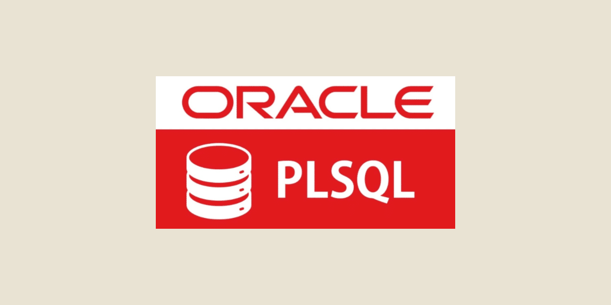

# PL/SQL



## **Table of Contents**

- [Introduction to PL/SQL](#introduction-to-plsql)

- [Data Types in PL/SQL](#data-types-in-plsql)

  - [Scalar](#scalar-data-types)
  - [Composite](#composite-data-types)

- [Variables and Constants](#variables-and-constants)

  - [Declaration Syntax](#declaration-syntax)
  - [Using %TYPE and %ROWTYPE](#using-type-and-rowtype)

- [PL/SQL Blocks](#sql-blocks)

  - [Structure](#structure)
  - [Types of Blocks](#type-of-blocks)

- [Interacting with User Input and Output](#interacting-with-user-input-and-output)

  - [User Input Using &](#user-input-using)
  - [Output Using DBMS OUTPUT](#output-using-dbms-output)

- [Control Structures](#control-structures)

  - [Conditional Statements](#conditional-statements)
    - [IF-THEN-ELSE](#if-then-else)
    - [CASE](#case)
  - [Loops](#loops)
    - [Basic Loop](#basic-loop)
    - [FOR Loop](#for-loop)
    - [WHILE Loop](#while-loop)
  - [Flow Control](#flow-control)
    - [GOTO](#goto)
    - [EXIT](#exit)

- [Error Handling](#error-handling)

- [Composite Data Types in PL/SQL](#composite-data-types-in-plsql)

  - [1. `RECORD` Data Type](#1-record-data-type)
  - [2. Indexed Tables (Index-By Tables)](#2-indexed-tables-index-by-tables)
  - [3. Nested Tables](#3-nested-tables)
  - [4. Varrays (Variable-Size Arrays)](#4-varrays-variable-size-arrays)
  - [5. Collection Methods in PL/SQL](#5-collection-methods-in-plsql)

- [Cursors](#cursors)

- [Procedures](#procedures)

  - [Creating Procedures](#creating-procedures)
  - [Executing Procedures](#executing-procedures)
  - [Modifying Procedures](#modifying-procedures)
  - [Dropping Procedures](#dropping-procedures)

- [Functions](#functions)

  - [Creating Functions](#creating-functions)
  - [Executing Functions](#executing-functions)
  - [Modifying Functions](#modifying-functions)
  - [Dropping Functions](#dropping-functions)

- [Triggers](#triggers)

  - [Creating Triggers](#creating-triggers)
  - [Types of Triggers](#types-of-triggers)
  - [Modifying Triggers](#modifying-triggers)
  - [Dropping Triggers](#dropping-triggers)

- [Packages](#packages)

  - [Creating Packages](#creating-packages)
  - [Using Packages](#using-packages)
  - [Modifying Packages](#modifying-packages)
  - [Dropping Packages](#dropping-packages)

## **Introduction to PL/SQL**

PL/SQL (Procedural Language/SQL) extends SQL with procedural constructs, allowing for complex logic in database operations. PL/SQL enables:

- **SQL Integration**: Execute SQL queries within PL/SQL.
- **Procedural Logic**: Use variables, loops, conditionals, and exception handling.
- **Reusability**: Create stored procedures, functions, and packages for modular code.

## **Data Types in PL/SQL**

### **Scalar Data Types**

PL/SQL supports several scalar types for storing single values:

- **Numeric Types**:

  - `NUMBER`: General-purpose numeric type with subtypes (`DECIMAL`, `NUMERIC`, `FLOAT`, `DOUBLE PRECISION`, `INT`, `INTEGER`, `SMALLINT`, `REAL`).
  - `BINARY_FLOAT`, `BINARY_DOUBLE`: High-performance floating-point types.
  - `PLS_INTEGER`, `BINARY_INTEGER`: Subtypes include `NATURAL`, `NATURALN`, `POSITIVE`, `POSITIVEN`, `SIGNTYPE`, `SIMPLE_INTEGER`.

- **Character Types**:

  - `VARCHAR2`, `VARCHAR`: Used for variable-length string storage.
  - `CHAR`, `CHARACTER`: Used for fixed-length character storage.

- **Unicode Types**:

  - `NCHAR`, `NVARCHAR2`: Store Unicode character data.

- **Date and Time Types**:

  - `DATE`, `TIMESTAMP`, `TIMESTAMP WITH TIME ZONE`, `TIMESTAMP WITH LOCAL TIME ZONE`: For storing date and time values.
  - `INTERVAL YEAR TO MONTH`, `INTERVAL DAY TO SECOND`: For storing time intervals.

- **Boolean Type**:
  - `BOOLEAN`: Stores logical values (`TRUE`, `FALSE`, or `NULL`).

### **Composite Data Types**

Composite types group multiple values:

- **`RECORD`**: Structure for grouped fields with various types.
- **Collections**:
  - **Index-By Tables**: Key-value pairs.
  - **Nested Tables**: Unordered collections of elements.
  - **VARRAYs**: Ordered collections with a fixed maximum size.

## **Variables and Constants**

### **Declaration Syntax**

Variables and constants are declared with a specific type:

```sql
identifier [CONSTANT] data_type [NOT NULL] [{:= | DEFAULT} value];
```

Example:

```sql
salary NUMBER := 50000;
bonus CONSTANT NUMBER(1,2) := 0.1;
hours NUMBER NOT NULL := 8;
```

### **Using `%TYPE` and `%ROWTYPE`**

**Used instead of a `data_type`**

- **`%TYPE`**: Derives a variable's type from an existing database column or variable.
  ```sql
  identifier table_name.column_name%TYPE;
  ```
- **`%ROWTYPE`**: Creates a variable with the same structure as a database table or cursor.
  ```sql
  identifier table_name%ROWTYPE;
  ```

## **PL/SQL Blocks**

PL/SQL is block-structured, allowing for modular and nested code.

### **Structure**

```sql
[<<block_label>>]
DECLARE
  -- Declarations
BEGIN
  -- Executable statements
[EXCEPTION]
  -- Error-handling statements
END [block_label];
[/] -- The block is complete
```

### **Types of Blocks**

1. `Anonymous Blocks`:
   - Unnamed, compiled and executed at runtime.
   - Even if they contain a label, they are still anonymus.
2. `Named Blocks`:
   - Procedures, Functions, Triggers, or Packages stored in the database.

## **Interacting with User Input and Output**

### **User Input Using `&`**

PL/SQL allows for user input during script execution by using substitution variables denoted by `&`.

- The `&variable_name` syntax prompts the user to enter a value, which is then substituted into the script.

**Example**:

```sql
DECLARE
  name VARCHAR2(50);
BEGIN
  name := '&user_name';
  DBMS_OUTPUT.PUT_LINE('Hello, ' || name || '!');
END;
/
```

**Explanation**:

- When the script runs, it prompts the user with a message like `Enter value for user_name:`.
- The entered value is assigned to the `name` variable.

---

### **Output Using DBMS OUTPUT**

The `DBMS_OUTPUT.PUT_LINE` procedure is a simple way to display messages or variable values to the console during PL/SQL execution.

**Example**:

```sql
DECLARE
  total_sales NUMBER := 5000;
BEGIN
  DBMS_OUTPUT.PUT_LINE('The total sales are: ' || total_sales);
END;
/
```

**Explanation**:

- The `DBMS_OUTPUT.PUT_LINE` procedure takes a string as input and prints it to the console.
- Strings can be concatenated with variable values using the `||` operator.

## **Control Structures**

PL/SQL supports various control statements for managing the flow of execution, enabling developers to implement logic, loops, and conditional branching in their code.

### **Conditional Statements**

- **IF-THEN-ELSE**:
  Used to execute a block of statements based on a condition. If the condition evaluates to `TRUE`, the statements in the `THEN` block are executed; otherwise, the `ELSE` block (if provided) is executed.

  ```sql
  IF condition THEN
    -- Statements executed if condition is TRUE
  ELSE
    -- Statements executed if condition is FALSE
  END IF;
  ```

  **Explanation**:
  The `IF-THEN-ELSE` structure allows you to control the flow of the program based on whether a certain condition is met. If no `ELSE` is provided, the `THEN` block will be skipped when the condition is false.

- **CASE**:
  A more flexible way to handle multiple conditions. It allows you to test one expression against multiple possible values.

  ```sql
  CASE expression
    WHEN value1 THEN
      -- Action for value1
    WHEN value2 THEN
      -- Action for value2
    ELSE
      -- Default action when no value matches
  END CASE;
  ```

  **Explanation**:
  The `CASE` statement checks the value of the given `expression` and compares it with several possible `WHEN` values. If a match is found, the corresponding action is executed. If no match occurs, the `ELSE` block (if present) is executed.

### **Loops**

Loops are used to repeat a block of statements multiple times.

- **Basic Loop**:
  A simple loop structure that keeps executing statements until an explicit exit condition is met.

  ```sql
  LOOP
    -- Statements
    EXIT WHEN condition;  -- Exit loop when condition is TRUE
  END LOOP;
  ```

  **Explanation**:
  The `LOOP` structure will run indefinitely unless the `EXIT` condition is met. The `EXIT WHEN` clause allows you to break out of the loop when a specific condition becomes true.

- **FOR Loop**:
  A loop that iterates a fixed number of times, often used when you know how many times the loop should run.

  ```sql
  FOR i IN 1..10 LOOP
    -- Statements executed for each value of i from 1 to 10
  END LOOP;
  ```

  **Explanation**:
  The `FOR` loop automatically initializes the loop variable (`i` in this case) and runs until the condition (`i <= 10`) is no longer true. The loop variable increments by 1 by default, but you can customize the step size.

- **WHILE Loop**:
  Executes statements as long as the given condition remains `TRUE`.

  ```sql
  WHILE condition LOOP
    -- Statements executed while condition is TRUE
  END LOOP;
  ```

  **Explanation**:
  The `WHILE` loop checks the condition before each iteration. If the condition is `TRUE`, the statements inside the loop are executed. If the condition is `FALSE` from the start, the loop does not execute at all.

### **Flow Control**

- **GOTO**:
  A statement used to jump to a specific label in the code. It's generally discouraged in modern programming because it can lead to unclear code structure, but it's still available in PL/SQL.

  ```sql
  GOTO label;
  -- Some code
  label:
    -- Code executed when GOTO is called
  ```

  **Explanation**:
  `GOTO` transfers control to a specific location in the code, labeled with `label:`. While `GOTO` can be useful in certain cases, it should be used sparingly because it can make the flow of control harder to follow.

- **EXIT**:
  Used to exit from loops, including `LOOP`, `FOR`, or `WHILE`. The `EXIT` statement can be used with a condition to break out of the loop early.

  ```sql
  EXIT WHEN condition;  -- Exit loop when condition is TRUE
  ```

  **Explanation**:
  The `EXIT` statement provides a way to break out of a loop based on a condition. If the condition is `TRUE`, control is transferred to the next statement following the loop.

## **Error Handling**

PL/SQL includes robust error management using the `EXCEPTION` block:

```sql
BEGIN
  -- Statements
EXCEPTION
  WHEN NO_DATA_FOUND THEN
    -- Handle exception
  WHEN OTHERS THEN
    -- Handle other exceptions
END;
```

## **Composite Data Types in PL/SQL**

### **1. `RECORD` Data Type**

The `RECORD` type is a composite data structure in PL/SQL, allowing you to group multiple fields (attributes) of different data types into a single unit.

**Key Characteristics:**

- **Grouping of Fields:** A `RECORD` stores related data of various types under one variable.
- **No Fixed Number of Fields:** You can include as many fields as necessary.
- **Default Values and Constraints:** Fields within a `RECORD` can have default values and constraints, such as `NOT NULL`.
- **Automatic Initialization:** Fields are automatically initialized to `NULL`.
- **Scope of Use:** You can define `RECORD` types in the declarative section of a PL/SQL block, subprogram, or package, and even nest `RECORD` types within each other.

**Syntax**:

```sql
TYPE record_type IS RECORD (
  field_name1 datatype | variable%TYPE | table.column%TYPE | table%ROWTYPE
  [ [NOT NULL] {:= | DEFAULT} expression1 ],
  field_name2 datatype | variable%TYPE | table.column%TYPE | table%ROWTYPE
  [ [NOT NULL] {:= | DEFAULT} expression2 ],
  ...
);

variable_name record_type;
```

**Accessing Fields:**

You can access fields within a `RECORD` using the following syntax:

```sql
record_variable.field_name
```

**Example:**

```sql
DECLARE
  TYPE EmployeeRecord IS RECORD (
    employee_id NUMBER,
    first_name VARCHAR2(50),
    last_name VARCHAR2(50)
  );

  emp EmployeeRecord;
BEGIN
  emp.employee_id := 101;
  emp.first_name := 'John';
  emp.last_name := 'Doe';

  DBMS_OUTPUT.PUT_LINE('Employee ID: ' || emp.employee_id);
  DBMS_OUTPUT.PUT_LINE('Name: ' || emp.first_name || ' ' || emp.last_name);
END;
```

---

### **2. Indexed Tables (Index-By Tables)**

An indexed table is a collection that stores key-value pairs, where the key is unique and is used to access the corresponding value.

**Key Characteristics:**

- **Dynamic Size:** Indexed tables can grow as needed.
- **No Initial Values:** You must explicitly initialize each element after declaration.
- **Index Types:** Indices can be of type `PLS_INTEGER`, `BINARY_INTEGER`, or `VARCHAR2(n)`.

**Syntax:**

```sql
TYPE indexed_table_type IS TABLE OF
  {datatype | variable%TYPE | table.column%TYPE}[NOT NULL]
  | table%ROWTYPE
INDEX BY PLS_INTEGER | BINARY_INTEGER | VARCHAR2(n);

variable indexed_table_type;
```

**Example:**

```sql
DECLARE
  TYPE SalaryTable IS TABLE OF NUMBER INDEX BY PLS_INTEGER;
  salaries SalaryTable;
BEGIN
  salaries(1) := 50000;
  salaries(2) := 60000;

  DBMS_OUTPUT.PUT_LINE('Salary of Employee 1: ' || salaries(1));
  DBMS_OUTPUT.PUT_LINE('Salary of Employee 2: ' || salaries(2));
END;
```

---

### **3. Nested Tables**

A nested table is a collection similar to an indexed table but without an explicit index clause. It is an unordered collection of elements of the same type.

**Key Characteristics:**

- **No Index Clause:** A nested table doesn't use the `INDEX BY` clause.
- **Dynamic Growth:** Like indexed tables, nested tables grow dynamically.
- **Implicit Indexing:** Nested tables use consecutive integers as indices, but after deletions, gaps may exist in the indices.

**Syntax:**

```sql
[CREATE [OR REPLACE]] TYPE nested_table_type IS TABLE OF
  {datatype | variable%TYPE | table.column%TYPE}[NOT NULL]
  | table%ROWTYPE;

variable nested_table_type;
```

**Example:**

```sql
DECLARE
  TYPE NameTable IS TABLE OF VARCHAR2(50);
  names NameTable;
BEGIN
  names := NameTable('Alice', 'Bob', 'Charlie');

  DBMS_OUTPUT.PUT_LINE('First Name: ' || names(1));
  DBMS_OUTPUT.PUT_LINE('Second Name: ' || names(2));
END;
```

---

### **4. Varrays (Variable-Size Arrays)**

A varray is a collection where elements are stored in a specific order, and the maximum size of the collection is predefined.

**Key Characteristics:**

- **Fixed Maximum Size:** The maximum size is specified when the varray is declared.
- **Order Matters:** The position of elements within the varray is important.
- **Syntax:**

```sql
[CREATE [OR REPLACE]] TYPE varray_type IS VARRAY(limit) OF
  {datatype | variable%TYPE | table.column%TYPE}[NOT NULL]
  | table%ROWTYPE;

variable varray_type;
```

**Example:**

```sql
DECLARE
  TYPE NumberVarray IS VARRAY(5) OF NUMBER;
  nums NumberVarray;
BEGIN
  nums := NumberVarray(10, 20, 30, 40, 50);

  DBMS_OUTPUT.PUT_LINE('First number: ' || nums(1));
  DBMS_OUTPUT.PUT_LINE('Last number: ' || nums(5));
END;
```

---

### **5. Collection Methods in PL/SQL**

PL/SQL provides several methods for managing collections, which include indexed tables, nested tables, and varrays. These methods are only available within procedural code, not in SQL statements.

**Syntax for Calling Methods:**

```sql
collection_name.method_name([parameters])
```

**Available Methods:**

- **COUNT:** Returns the number of elements in a collection.
- **DELETE(n):** Removes the element at index `n`. For a range, use `DELETE(m, n)` to delete elements between indices `m` and `n`.
- **EXISTS(n):** Checks if the element at index `n` exists. Returns `TRUE` if it exists, otherwise `FALSE`.
- **FIRST, LAST:** Returns the index of the first or last element.
- **NEXT(n), PRIOR(n):** Returns the index of the next or previous element relative to the `n`-th element.
- **EXTEND:** Adds elements to the collection.
  - `EXTEND`: Adds one `NULL` element.
  - `EXTEND(n)`: Adds `n` `NULL` elements.
  - `EXTEND(n, i)`: Adds `n` copies of the `i`-th element.
- **LIMIT:** Returns the maximum number of elements for a collection (for varrays) or `NULL` for nested tables.
- **TRIM:** Removes elements from the end of a collection.
  - `TRIM`: Removes the last element.
  - `TRIM(n)`: Removes the last `n` elements.

**Note:** The `EXISTS` method is the only one that can be used on a `NULL` collection.

## **Cursors**

Cursors are pointers to the context area created by Oracle for processing SQL statements. They allow developers to fetch and manipulate rows returned by a query.

### **Types of Cursors**

PL/SQL supports two types of cursors:

1. **Implicit Cursors**: Automatically created by Oracle when executing DML or SELECT INTO statements.
2. **Explicit Cursors**: Defined by the programmer to provide more control over query results.

---

### **Implicit Cursors**

Oracle automatically manages implicit cursors. These cursors are created for statements like INSERT, UPDATE, DELETE, or SELECT INTO.

**Attributes of Implicit Cursors**

Implicit cursors can be referenced using the SQL cursor, which has the following attributes:

| Attribute   | Description                                                                  |
| ----------- | ---------------------------------------------------------------------------- |
| `%FOUND`    | Returns `TRUE` if a DML or SELECT INTO statement affected one or more rows.  |
| `%NOTFOUND` | Returns `TRUE` if no rows were affected or retrieved.                        |
| `%ISOPEN`   | Always returns `FALSE` because Oracle closes implicit cursors automatically. |
| `%ROWCOUNT` | Returns the number of rows affected or retrieved.                            |

#### **Example of Implicit Cursors**

Using SQL%ROWCOUNT to check rows affected by an update:

```sql
DECLARE
   total_rows NUMBER(2);
BEGIN
   UPDATE customers
   SET salary = salary + 500;

   IF sql%notfound THEN
      dbms_output.put_line('No customers selected');
   ELSIF sql%found THEN
      total_rows := sql%rowcount;
      dbms_output.put_line(total_rows || ' customers selected');
   END IF;
END;
/
```

**Output:**

```
6 customers selected
PL/SQL procedure successfully completed.
```

### **Explicit Cursors**

Explicit cursors allow more control and are defined in the declaration section of a PL/SQL block. They must be manually opened, fetched, and closed.

#### **Steps to Use Explicit Cursors**

1. **Declare the Cursor**: Define a SELECT statement for the cursor.
   ```sql
   CURSOR cursor_name [(parameter data_type, ..)] IS SELECT_statement;
   ```
2. **Open the Cursor**: Allocate memory and associate it with the cursor.
   ```sql
   OPEN cursor_name [(parameter, ..)];
   ```
3. **Fetch the Cursor**: Retrieve rows one at a time.
   ```sql
   FETCH cursor_name INTO variable1, variable2, ..;
   ```
4. **Verify the cursor**: Verify with `%FOUND` and `%NOTFOUND`. These attributes help in determining if the fetch operation was successful.

   ```sql
   cursor_name%NOTFOUND = TRUE -- if none of the rows were processed
   cursor_name%FOUND = TRUE -- if at least one row was processed
   ```

5. **Close the Cursor**: Release the memory associated with the cursor.
   ```sql
   CLOSE cursor_name;
   ```

#### **Example of Explicit Cursors**

```sql
DECLARE
   c_id customers.id%TYPE;
   c_name customers.name%TYPE;
   c_addr customers.address%TYPE;
   CURSOR c_customers IS
      SELECT id, name, address FROM customers;
BEGIN
   OPEN c_customers;
   LOOP
      FETCH c_customers INTO c_id, c_name, c_addr;
      EXIT WHEN c_customers%notfound;
      dbms_output.put_line(c_id || ' ' || c_name || ' ' || c_addr);
   END LOOP;
   CLOSE c_customers;
END;
/
```

**Output:**

```
1 Ramesh Ahmedabad
2 Khilan Delhi
3 Kaushik Kota
4 Chaitali Mumbai
5 Hardik Bhopal
6 Komal MP

PL/SQL procedure successfully completed.
```

## **Procedures**

### **Creating Procedures**

A procedure is a named PL/SQL block that performs a specific task. Procedures can accept parameters and execute a series of SQL statements.

**Syntax:**

```sql
CREATE [OR REPLACE] PROCEDURE procedure_name
   [parameter1 datatype, parameter2 datatype, ...]
IS
BEGIN
   -- Executable statements
EXCEPTION
   -- Exception handling statements
END procedure_name;
```

**Example:**

```sql
CREATE OR REPLACE PROCEDURE greet_user (user_name VARCHAR2) IS
BEGIN
   DBMS_OUTPUT.PUT_LINE('Hello, ' || user_name || '!');
END greet_user;
```

### **Executing Procedures**

You can execute a stored procedure using the `EXEC` or `BEGIN ... END;` block.

**Example:**

```sql
EXEC greet_user('Alice');
```

### **Modifying Procedures**

To modify a procedure, you can recompile it using the `CREATE OR REPLACE PROCEDURE` statement. This allows you to make changes without dropping and recreating the procedure.

**Example:**

```sql
CREATE OR REPLACE PROCEDURE greet_user (user_name VARCHAR2) IS
BEGIN
   DBMS_OUTPUT.PUT_LINE('Welcome, ' || user_name || '!');
END greet_user;
```

### **Dropping Procedures**

To remove a procedure from the database, use the `DROP PROCEDURE` statement.

**Example:**

```sql
DROP PROCEDURE greet_user;
```

## **Functions**

### **Creating Functions**

A function is similar to a procedure but it returns a value. Functions can accept parameters, perform operations, and return a single value.

**Syntax:**

```sql
CREATE [OR REPLACE] FUNCTION function_name
   (parameter1 datatype, parameter2 datatype, ...)
   RETURN return_datatype
IS
BEGIN
   -- Executable statements
   RETURN value;
EXCEPTION
   -- Exception handling statements
END function_name;
```

**Example:**

```sql
CREATE OR REPLACE FUNCTION add_numbers (num1 NUMBER, num2 NUMBER)
   RETURN NUMBER IS
BEGIN
   RETURN num1 + num2;
END add_numbers;
```

### **Executing Functions**

You can execute a function in a SQL query or within PL/SQL blocks.

**Example:**

```sql
DECLARE
   result NUMBER;
BEGIN
   result := add_numbers(10, 20);
   DBMS_OUTPUT.PUT_LINE('The sum is: ' || result);
END;
```

### **Modifying Functions**

To modify a function, use the `CREATE OR REPLACE FUNCTION` statement.

**Example:**

```sql
CREATE OR REPLACE FUNCTION add_numbers (num1 NUMBER, num2 NUMBER)
   RETURN NUMBER IS
BEGIN
   RETURN num1 + num2 + 10;
END add_numbers;
```

### **Dropping Functions**

To remove a function from the database, use the `DROP FUNCTION` statement.

**Example:**

```sql
DROP FUNCTION add_numbers;
```

## **Triggers**

### **Creating Triggers**

A trigger is a stored PL/SQL block that is automatically executed in response to certain events, such as an insert, update, or delete operation on a table or view.

**Syntax:**

```sql
CREATE [OR REPLACE] TRIGGER trigger_name
   {BEFORE | AFTER} {INSERT | UPDATE | DELETE}
   ON table_name
   [FOR EACH ROW]
IS
BEGIN
   -- Trigger actions
END trigger_name;
```

**Example:**

```sql
CREATE OR REPLACE TRIGGER before_insert_employee
   BEFORE INSERT ON employees
   FOR EACH ROW
IS
BEGIN
   :new.creation_date := SYSDATE;
END before_insert_employee;
```

### **Types of Triggers**

Triggers can be categorized as follows:

- **BEFORE Triggers**: Executed before the triggering SQL statement (e.g., `INSERT`, `UPDATE`, `DELETE`).
- **AFTER Triggers**: Executed after the triggering SQL statement.
- **INSTEAD OF Triggers**: Used to replace the triggering action with custom code.

### **Modifying Triggers**

To modify an existing trigger, you need to recompile it with the `CREATE OR REPLACE TRIGGER` statement.

**Example:**

```sql
CREATE OR REPLACE TRIGGER before_insert_employee
   BEFORE INSERT ON employees
   FOR EACH ROW
IS
BEGIN
   :new.creation_date := SYSDATE;
   :new.status := 'Active';
END before_insert_employee;
```

### **Dropping Triggers**

To remove a trigger, use the `DROP TRIGGER` statement.

**Example:**

```sql
DROP TRIGGER before_insert_employee;
```

## **Packages**

### **Creating Packages**

A package is a collection of related procedures, functions, variables, and types that are grouped together. A package consists of two parts: the specification and the body.

**Syntax:**

```sql
CREATE OR REPLACE PACKAGE package_name IS
   -- Declarations of procedures, functions, types, variables
END package_name;
```

The body of the package contains the implementation of the procedures and functions.

```sql
CREATE OR REPLACE PACKAGE BODY package_name IS
   -- Implementation of procedures, functions
END package_name;
```

**Example:**

```sql
CREATE OR REPLACE PACKAGE employee_pkg IS
   PROCEDURE greet_employee (employee_name VARCHAR2);
   FUNCTION get_employee_salary (employee_id NUMBER) RETURN NUMBER;
END employee_pkg;
```

```sql
CREATE OR REPLACE PACKAGE BODY employee_pkg IS
   PROCEDURE greet_employee (employee_name VARCHAR2) IS
   BEGIN
      DBMS_OUTPUT.PUT_LINE('Hello, ' || employee_name);
   END greet_employee;

   FUNCTION get_employee_salary (employee_id NUMBER) RETURN NUMBER IS
      salary NUMBER;
   BEGIN
      SELECT salary INTO salary
      FROM employees
      WHERE employee_id = employee_id;
      RETURN salary;
   END get_employee_salary;
END employee_pkg;
```

### **Using Packages**

After creating a package, you can call the procedures and functions defined in the package.

**Example:**

```sql
BEGIN
   employee_pkg.greet_employee('Alice');
   DBMS_OUTPUT.PUT_LINE('Salary: ' || employee_pkg.get_employee_salary(101));
END;
```

### **Modifying Packages**

To modify a package, you can use the `CREATE OR REPLACE PACKAGE` or `CREATE OR REPLACE PACKAGE BODY` statement to update the package specification or body.

**Example:**

```sql
CREATE OR REPLACE PACKAGE BODY employee_pkg IS
   PROCEDURE greet_employee (employee_name VARCHAR2) IS
   BEGIN
      DBMS_OUTPUT.PUT_LINE('Welcome, ' || employee_name || '!');
   END greet_employee;

   FUNCTION get_employee_salary (employee_id NUMBER) RETURN NUMBER IS
      salary NUMBER;
   BEGIN
      SELECT salary INTO salary
      FROM employees
      WHERE employee_id = employee_id;
      RETURN salary;
   END get_employee_salary;
END employee_pkg;
```

### **Dropping Packages**

To remove a package, use the `DROP PACKAGE` and `DROP PACKAGE BODY` statements. If both parts of the package are to be removed, use both commands.

**Example:**

```sql
DROP PACKAGE employee_pkg;
DROP PACKAGE BODY employee_pkg;
```
